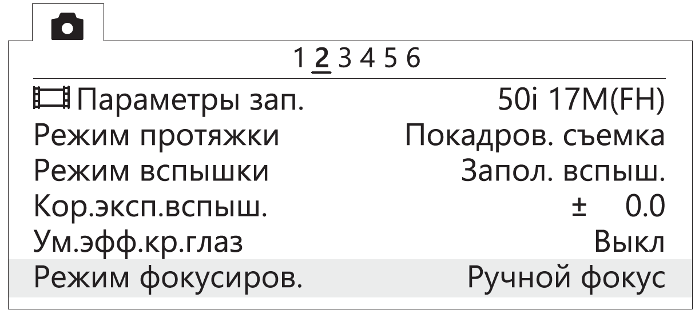
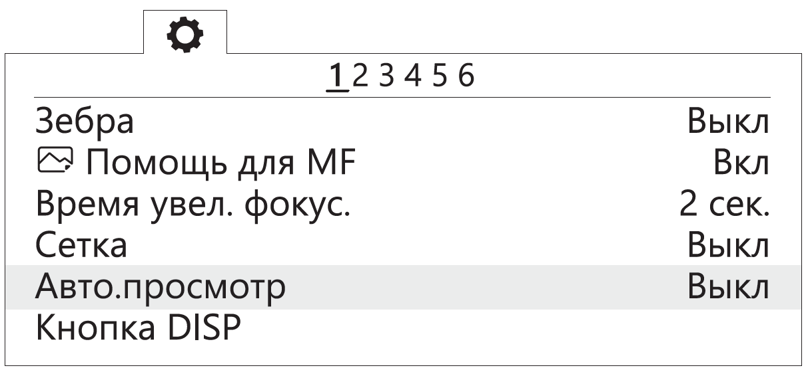
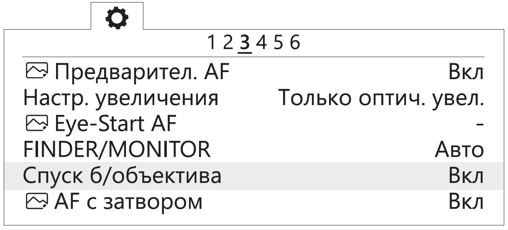
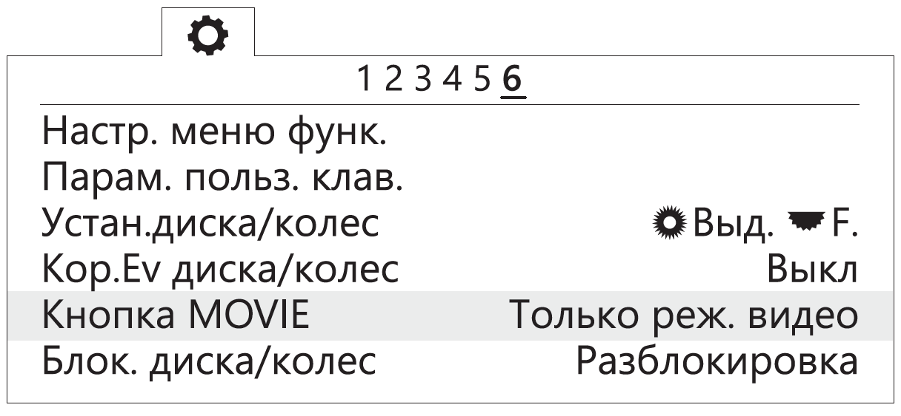
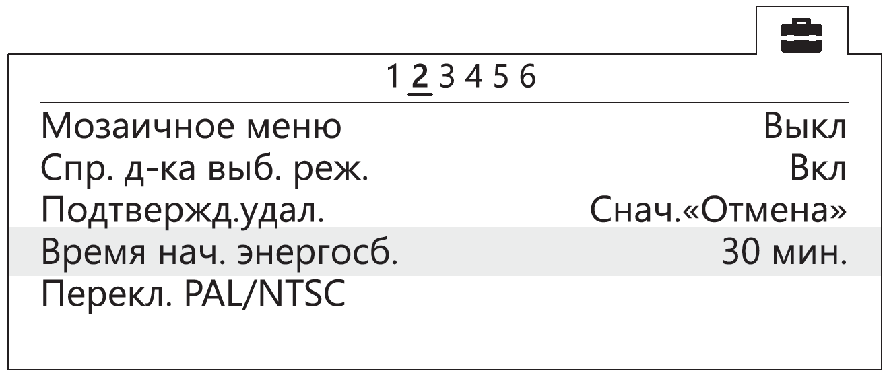
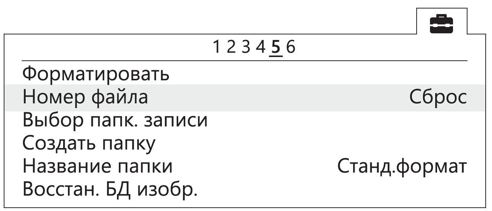

Setting up the camera
=========================

Setting up the Sony A6000 camera
------------------------------------

Before making settings, read the full operating instructions of the camera, which describes the purpose and use of the controls.

Set the mode dial to **S** (Shutter Priority).

Use the control wheel to set the following parameters:

.. csv-table:: 
   
   "Exposition", "1/800"
   "ISO", "Auto"

* In Photo menu (tab 2), set **Focus Mode** - *Manual focus*.

   Focus Mode

* In Custom settings menu (tab 1), disable **Automatic preview**.

   Automatic preview off

* In Custom settings menu (tab 3) turn on **Lens-less Shutter**.

   Turn on the shutter without a lens

* In Custom Settings menu (tab 6), set the **MOVIE** button - **Video mode only**.

   Set "Video Mode Only"

* In menu (tab 2) set **Start time energy saving** - **30 min**.

   Set the time to start energy saving

* In menu (tab 5), set **File Number** - **Reset**.

   Reset file number

Setting up the A6000 NIR
-------------------------------------

The following options are set in Photo menu:

* **Quality** - **RAW** in Photo menu (Tab 1);

.. .. figure ::_static/_images /menu 10.png
   : align: center
   : width: 400

   Set the quality

* **ISO** up to 400 (press the control wheel to the right to select);

* **Exposure compensation** from EV **+1** to EV **+2** (press the control wheel down to select).