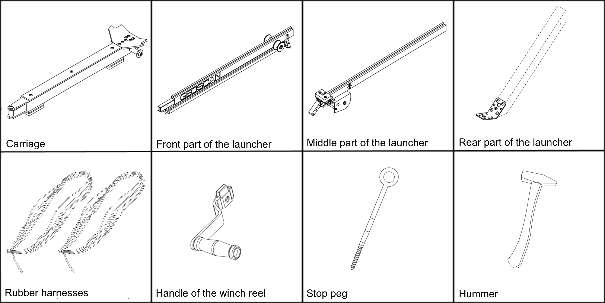
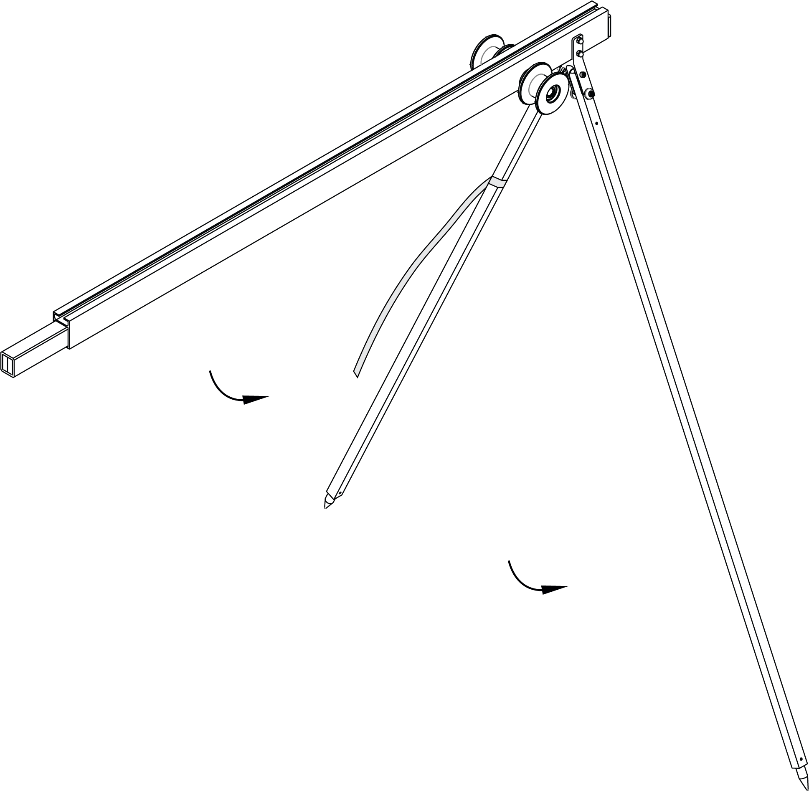
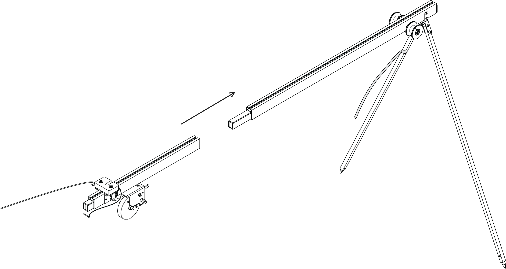
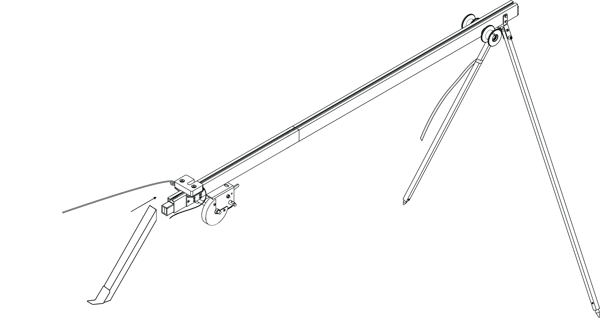
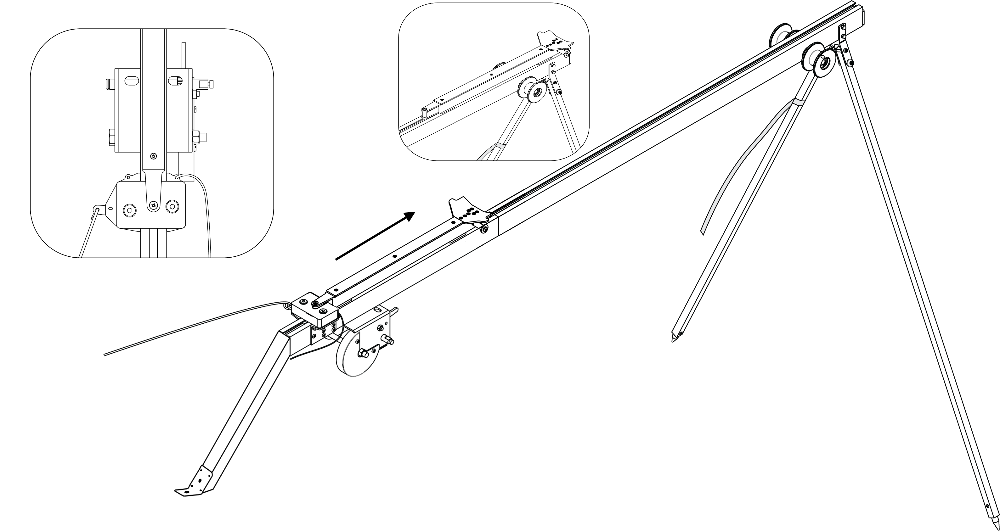
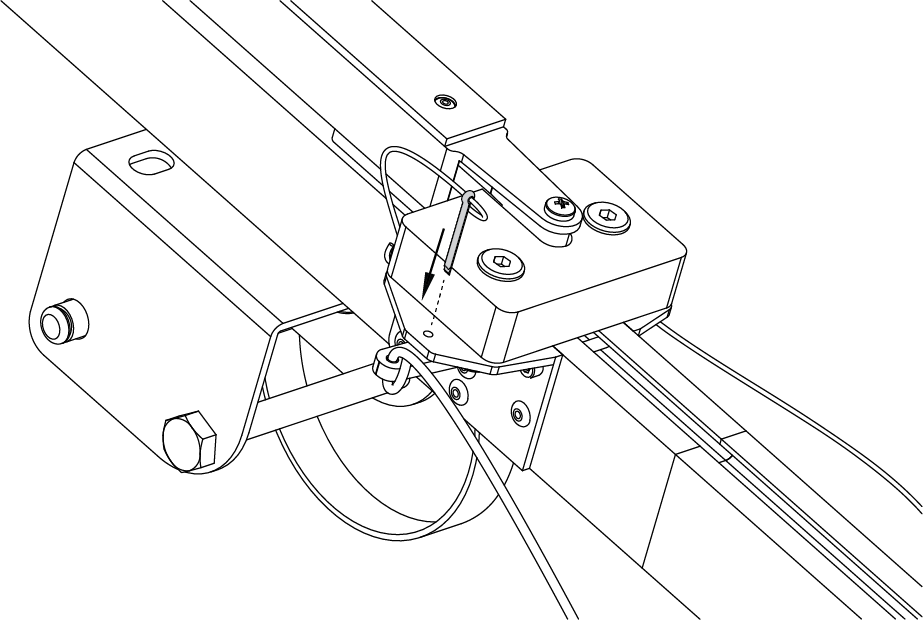
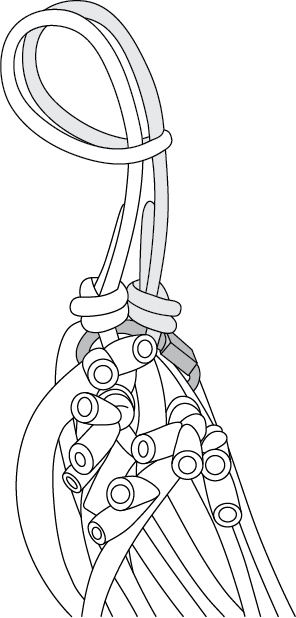
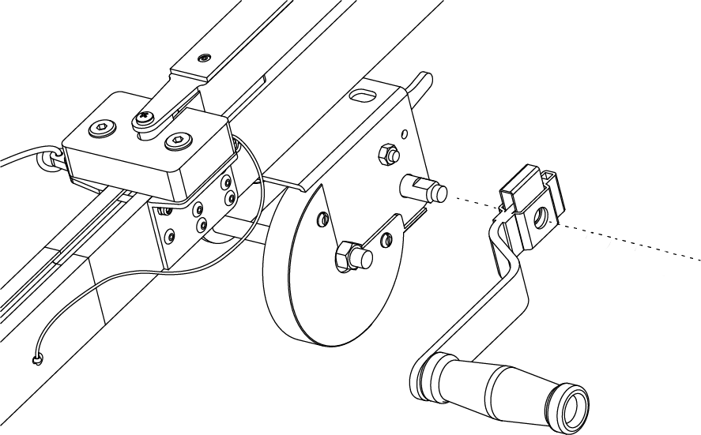

Launcher
=====================

Assembly
----------

1) Eject a parts of the launcher from the transport bag.
2) Spread out the supports on the front of the launcher. Make sure that they are securely fastened by locks. To fold the supports pull the locks down.

   Installation of supports

3) Attach the middle part of the launcher.

   Installation of the middle part of launcher

4) Attach the rear part of the launcher.

   Installation of the rear part of launcher

5) Insert the locking pin into the hole in the middle and rear part of the launcher.

6) Place the launcher on a flat surface so that the UAV is launched against the wind. Make sure that the launcher is stable on the ground and that its guide has no roll. If necessary, bury one of the supports to align the launcher.

.. attention:: The launch of the UAV is allowed strictly against the wind. It is strictly forbidden to launch the UAV in the wind. Failure to do so may cause the UAV to fall or collide with obstacles, as the UAV will not be able to gain altitude.

7) Install and hammer the stop peg into the bracket at the rear of the launcher to prevent displacement when the UAV starts.

.. attention::The peg must be hammered to avoid the launcher jumping at the start of the UAV. When you hammer in the peg, make sure not to deform the rear part of the launcher.

When starting the UAV, the jerk of the rubber harnesses leads to the throwing of the rear part of the launcher. To securely attach the launcher, score number on the entire length, achieving complete immobility of the rear support posts launcher. When scoring a stake, be careful not to deform the rear of the launcher.

8) Install the carriage onto the guide of the launcher, so that the rails of the carriage slid along the rails.

   Installation of the carriage

.. attention:: Before each start of the UAV make sure that the carriage slides on the rails without clinging to the joints of parts of the launcher.

9) Move the carriage down until it locks into the lock.
10) Insert the safety pin into the starting mechanism.

   Insert the safety pin

.. attention:: If you do not insert the pin, the lock may accidentally trigger.

11) Release the winch stopper and unwind the tension cable.
12) Take the rubber harnesses. Straighten the harnesses. Make sure that the harnesses are not overlapped.
13) From the rope ring at the end of the harness make a loop and hook the carriage.

   Loop on rope ring

14) Connect the other end of the rubber harness to the end of the starting cable with a carabiner. The starting cable must pass through the roller. The carbine must be immured.
15) Similarly, attach the second rubber harness.
16) Put the handle of the winch reel on the axle and slide until the reinforcement mechanism clicks.

   Installing the winch reel handle

Preparation of the launcher to launch the UAV
-----------------------------------------------

.. attention:: In order to ensure the safety of work on the launch pad and increase the life of rubber harnesses, pull the harnesses immediately before the start after the successful pre-launch preparation.

1) Move the winch stopper to the cable tension position.

2) pull the rubber tubing by rotating the handle of the reel of winch. In case of contact with the harness between the roller and the guide part of the launcher or break from the roller, it is necessary to stop the tension of the harnesses. The broken harness should be placed on the roller, after which you can continue to pull the harnesses of the launcher.

You must be stop stretching of the harnesses when carbines will be opposite to the marker "STOP" engraved on the middle part of the launcher.

Now the UAV can be placed on the launcher.

Rules for the treatment of rubber with harnesses
-----------------------------------------------------

* Check the condition of the rubber bands regularly. If cracks and scuffs are found, replace the damaged ring with a spare ring from the spare parts kit.
* Don't keep the rubber harnesses stretched for a long time. Stretch the harnesses directly before placing the UAV on the launcher.
* In the warm season, do not allow long-term exposure of rubber harnesses in direct sunlight.
* In the cold season, do not allow the rubber bands to freeze. Keep them in a warm place prior to installation on the launcher and pull directly before starting. After starting the UAV immediately remove the bands from the launcher and put to a warm place.