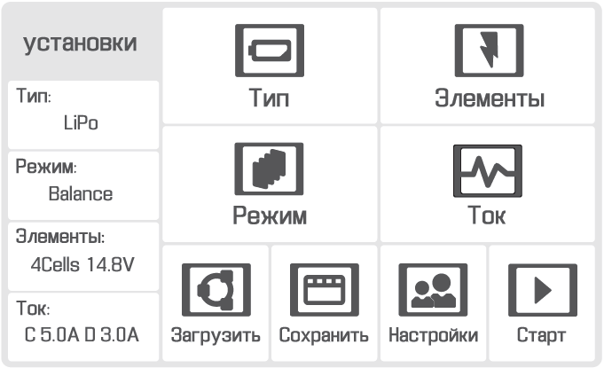
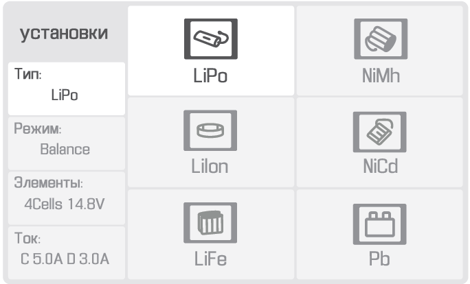
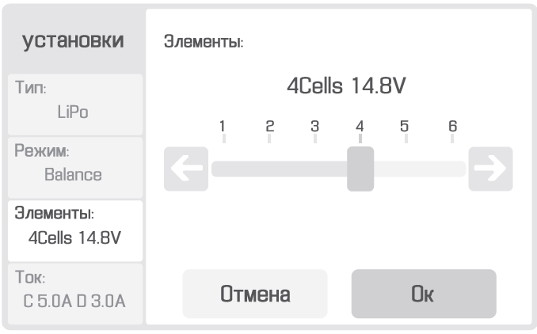
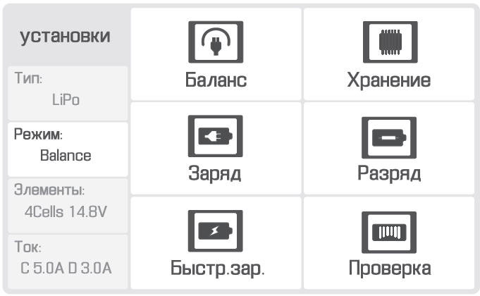
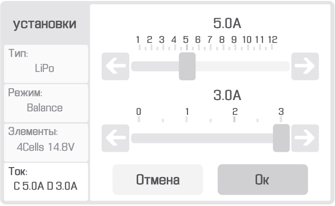
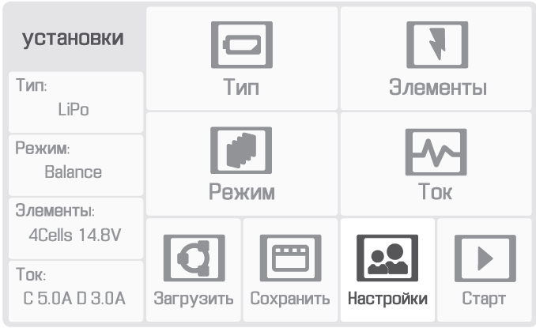
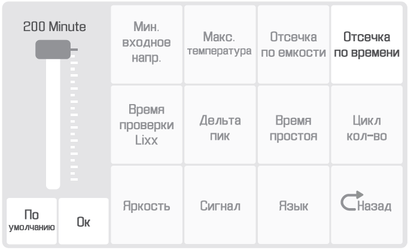
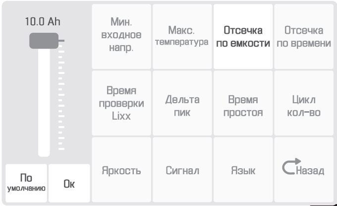
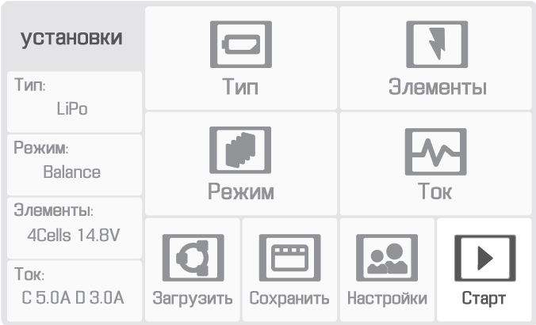

Charger and battery
=========================

.. csv-table:: **Parameters of battery**
   
   "Guaranteed number of charge-discharge cycles", "80"
   "Upper charge limit", "16.8 В"
   "Lower discharge limit", "13.2 В"
   "Charging current", "<10 А"
   "Number of cells", "4"
   "Capacity", "16 000 мА·ч"

Safety requirements
----------------------

**Battery**

* Avoid depressurization and deformation of battery elements (do not drop, do not pierce).
* Do not allow the battery to heat more than 60 degrees.
* Avoid overcharging the battery (over 16.8V). Do not allow the battery discharge below 12V.
* Do not store in a discharged state, with long-term storage of the battery (a month or more) must be transferred to the **Storage** mode.
* Do not charge with currents exceeding the load capacity (not more than 100% of the capacity, it is recommended to charge 50% of the capacity to extend the service life). Exceeding the permissible charge current will heat the battery over 60 degrees.
* Failure to comply with the above instructions may result in fire or complete failure of the battery.

**Charger**

* The charger must be switched on before connecting the battery to the charger.
* Cables and connectors must be inspected for damage before each use.
* Do not operate the charger in direct sunlight.
* Do not leave the charger without supervision.

The charger is set up from the factory. If the settings are off, follow the instructions to restore them.

Preset battery charger
----------------------------------------------------

Setting the charger by selecting the appropriate menu item using the touch screen. When you turn on the charger, you will see main menu.

**Setting battery charging parameters:**

In section **Type** select **LiPo**:

In section **Cells** select **4Cells** **14.8V**:

In section **Mode** select:

* **Balance only** for the battery charge.

* **Storage** to transfer the battery to storage mode.

* **Charge** to charge the battery without balancing the voltage on the elements (not recommended to charge in this mode).

* **Discharge** for battery discharge.

* **Quick Charge** for charging with high currents (not recommended to charge in this mode).

* **Checker** to check battery status.

In section **Current** choose **Charge: 5.0А**, **Discharge: 3.0А**:

Choose the section **Uset**:

In section **Uset** set **Cutoff Time** *200 Minute*:

In section **Uset** set **Cutoff Capacity** *10.0 Ah*:

Battery charging
---------------------
* Connect the AC power cable to the charger.

* Plug the power cord into an outlet.

* Connect the balancing cable to the battery being charged.

* Connect the power cable connector to the battery being charged.

* Check the settings of the charger and start the charge process by long (3 seconds) clicking on the icon **Start**.

* After charging is complete, turn off the battery in the reverse order.

Recommendations for the use of lithium polymer (LiPo) battery
---------------------------------------------------------------------

**Battery operation rules**

In order to avoid emergency situations related to the abnormal operation of the battery, the following rules must be observed:

If the flights are carried out at temperatures below 0 degrees, the battery must be stored in a warm place before the flight and avoid cooling. It should be remembered that in the cold lithium polymer batteries can lose up to 30% of its capacity, this fact must be taken into account when preparing the flight task;

If the flights are carried out at temperatures above 25 degrees, the battery must be stored in a cool place, protected from direct sunlight before the flight. After the flight, you can not immediately charge the battery, you need to let it cool down. It is also necessary to charge in a cool place, protected from direct sunlight.

Storage and discharge
--------------------------------------------
The storage mode is necessary if you do not intend to use the battery for more than 14 days.

To transfer the battery to the storage mode, you need to change the mode **Balance** to the mode **Storage**, checking the correct number of cells on the screen (4 Cells) and start it with a long press of the button **Start**.

Store in a cool dry place, excluding exposure to direct sunlight, at a temperature of 5 to 25 °C and a relative humidity of not more than 80%, without condensation.

The optimum temperature is from 5 to 10 °C.

Optimal battery voltage level for storing: 15.12 V.

Battery life cycle - 1 year.

Battery recycling
-------------------

.. attention:: Do not dispose of LiPo batteries in household waste containers. 
 Improper disposal of used power sources can be hazardous to the environment.
 Dispose of LiPo batteries in accordance with local regulations and take them to the nearest recycling points.

