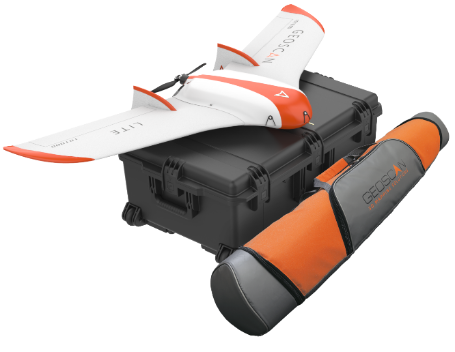

.. 101-doc documentation master file, created by
   sphinx-quickstart on Fri Dec 21 11:13:03 2018.
   You can adapt this file completely to your liking, but it should at least
   contain the root `toctree` directive.

Geoscan Lite. Assembly and aplication
=====================================================

General information
-----------------------

Geoscan Lite – aerial photography complex that allows you to build a photographic map of the area, an altitude matrix or a 3D model of the territory.

**Application**

Complex Geoscan Lite is designed to obtain georeferenced photos of objects and aerial photography.

**Field of application**

The data obtained using the complex can be used for:

* Terrain evaluaton;
* Aerial photography with precise time stamps for georeferenced images;
* Orthophotos and digital terrain models creation;
* Altitude maps creation;
* 3D terrain models ;
* Volumetric calculations for quarries and fills.

Kit
---------------------

* Geoscan Lite unmanned aerial vehicle (UAV) 
* UAV transport bag
* Launcher in transport bag
* Customized Sony А6000 camera
* 14.8 V LiPo battery  
* RCL modem with antenna
* Battery charger
* Geoscan Planner software
* Folding rack for UAV assembly
* Spare parts and accessories:

   * Fin - 2 PCs;
   * Stop peg for launcher;
   * Pitot tube cleaning rod (wire, 150 mm);
   * Pitot tube (brass, 70 mm);
   * Propeller blades 10x8;
   * USB cable.

Technical parameters
----------------------

.. csv-table:: 
   :header: "Characteristic", "Value"

   "Type of UAV", "flying wing"
   "Speed of flight", "64 - 130 km/h"
   "Max takeoff weight", "3.1 kg"
   "Max payload mass", "0.8 kg"
   "Photo shooting area in one flight","up to 9 km²"
   "Max wind speed","12 m/s"
   "Wingspan", "1.38 m"
   "Min safe flight altitude","100 m"
   "Max flight altitude","4000 m"
   "Engine","electric, brushless"
   "Battery","14.8 V LiPo "
   "Preparation time before takeoff","10 min"
   "Flight duration", "up to 60 min"
   "Max flight length","70 km"
   "Takeoff mechanism","catapult"
   "Landing","parachute"
   "Operating temperature range:","-20 to +40 °C"

Maintenance
-------------------------

After each flight, visually inspect UAV for a damage.

If propeller blades or keel is damaged, you can replace it yourself using spare parts and tools from the kit.

If structural damage to the airframe or systems is detected, contact ` Geoscan support <https://www.geoscan.aero/en/support>`_.

After 80 flights it is recommended to send your UAV to the manufacturer for inspection and maintenance.

Storage
-----------

Geoscan Lite complex (without battery) and launcher are recommended to be stored in a transport bags in dry rooms at a temperature of 5 to 25 °C and relative humidity not more than 80% without condensation. Shelf life - 2 years.

Batteries should be stored in a cool, dry place, away from direct sunlight, at a temperature of 5 to 25 °C and a relative humidity of 80%, without condensation. Optimal temperature is from 5 to 10 °C. Optimum battery storage voltage level: 15.12 V. Shelf Life - 1 year.

.. toctree::
   :maxdepth: 2
   :caption: Content:

   reference
   precautions
   uav
   nsu
   catapult
   camera
   charger
   planner
   launch
